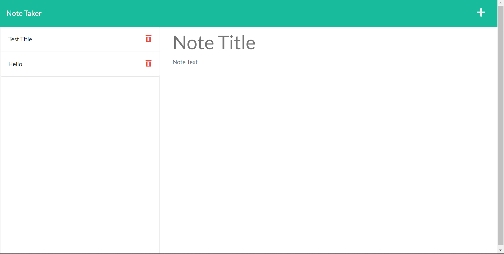

# Note Taker


## Description
 An application that can be used to write, save, and delete* notes. This application uses an Express.js back end and saves and retrieves note data from a JSON file.

## Technologies Used
- JavaScript
- Express.js
- Node.js

## Usage 
Type in the following command

``` 
npm start
```

```
nodemon
```

Open browser typing this URL
http://localhost:3000

*Notes can only be deleted when opening the program with nodemon.
